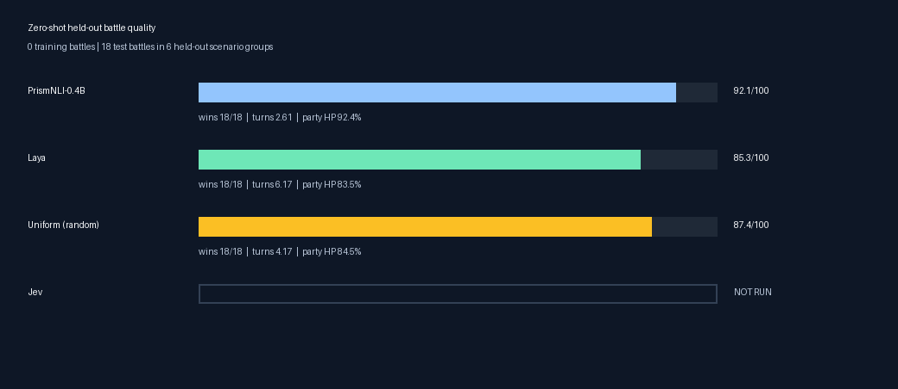
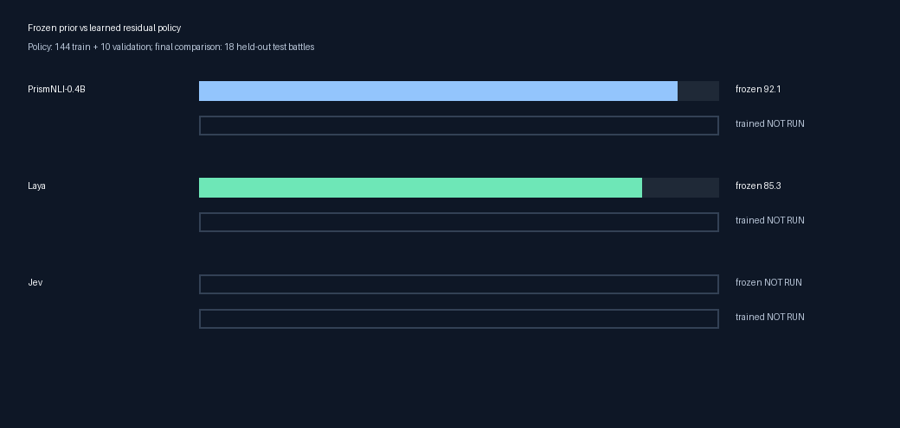
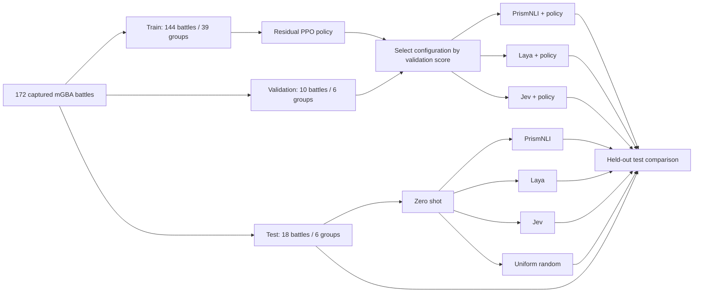

# Decision models learn to battle in Pokémon Emerald Rogue

This repository asks two questions using real trainer battles running in mGBA:

1. How well do **PrismNLI-0.4B, Laya, Jev, and uniform random legal actions** play unseen battles with no game-specific training?
2. Can a small learned policy improve PrismNLI, Laya, or Jev on the same held-out battles while the underlying model stays frozen?

The model is never fine-tuned. Training updates only a small residual PPO policy that steers the model's action probabilities. Uniform random is a zero-shot control and is not trained.

## Current results

The reproducible pilot corpus contains **172 saved Rogue battles**:

| Split | Battles | Scenario groups | Used for |
| --- | ---: | ---: | --- |
| Train | 144 | 39 | Residual PPO updates |
| Validation | 10 | 6 | Selecting the policy configuration without touching test |
| Test | 18 | 6 | Final zero-shot and trained-policy comparison |

The first zero-shot test is complete for PrismNLI, Laya, and uniform. Jev needs a valid OpenRouter credential. Residual policies have not been run yet, so the trained rows are explicitly marked `not run` rather than inferred or fabricated.

| Model / policy | Training battles | Validation battles | Test battles | Wins | Mean turns | Final party HP | Battle score |
| --- | ---: | ---: | ---: | ---: | ---: | ---: | ---: |
| PrismNLI-0.4B zero shot | 0 | 0 | 18 | 18/18 | 2.61 | 92.4% | 92.1 / 100 |
| Laya zero shot | 0 | 0 | 18 | 18/18 | 6.17 | 83.5% | 85.3 / 100 |
| Uniform random zero shot | 0 | 0 | 18 | 18/18 | 4.17 | 84.5% | 87.4 / 100 |
| Jev zero shot | 0 | 0 | 18 | — | — | — | Not run |
| PrismNLI + residual PPO | 144 | 10 | 18 | — | — | — | Not run |
| Laya + residual PPO | 144 | 10 | 18 | — | — | — | Not run |
| Jev + residual PPO | 144 | 10 | 18 | — | — | — | Not run |





All completed zero-shot arms won every test battle, so win rate alone cannot separate them. The battle score adds granularity: PrismNLI won faster and retained more party HP on this fixture. This remains a small pilot, not evidence of general Pokémon mastery.

## Experiment



Every arm sees the same public battle observation and engine-supplied legal action mask. Actions are four move slots plus six absolute party-switch slots. The experiment never reveals the opponent's hidden moves, held item, ability, exact HP, bench, or RNG state.

| Model | Frozen primitive used as the action prior |
| --- | --- |
| PrismNLI-0.4B | Entailment score for “this is a good action to win” |
| Laya | One binary Noul quality score per legal action |
| Jev | Typed Choice probabilities from the hosted Decisions API |
| Uniform random | Equal probability over legal actions; control only |

For the trained arms, PPO learns residual logits on top of the fixed prior:

```text
final_policy = softmax(log(frozen_prior) + residual_policy(observation))
```

PrismNLI, Laya, and Jev weights never enter the optimizer.

## How battle quality is measured

The game outcome remains the primary result. Within the same outcome, a battle is better when it finishes quickly and preserves the team. For a win with final party HP fraction `H` and game-reported turns `T`:

```text
win_quality = 100 × (0.65 × H + 0.35 × exp(-T / 6))
battle_score = 50 + 0.5 × win_quality
```

This makes a two-turn full-health win score much better than a ten-turn win at half health, while every win still scores above a draw, loss, or truncation.

| Outcome | Battle score |
| --- | --- |
| Win | 50–100, based on party HP and turns |
| Draw | 25 |
| Loss | 0–20, based on remaining party HP |
| Truncation | 0 |

The final table always reports raw wins, turns, party HP, and battle score so the scalar can be audited. Latency, action diversity, switch rate, residual KL, and argmax override rate are additional diagnostics.

Policy configurations are chosen on validation in this order: scenario-weighted win rate, mean battle score, final party HP, then fewer turns. The test set is used once after selection. Results are averaged across learner seeds 0–4; the best-looking test seed is never selected for publication. See [the complete scoring rule](docs/scoring.md).

## Reproduce the environment

Requirements are Apple Silicon, macOS 15+, Python 3.11–3.13, mGBA 0.10.5, `uv`, and a legally obtained Pokémon Emerald ROM used to build Emerald Rogue. ROMs, model weights, save states, credentials, and run outputs are ignored by Git.

```sh
git clone https://github.com/elcronos/RL_zeroshot.git
cd RL_zeroshot
uv sync --extra laya --extra prism --extra test
uv run python scripts/setup_laya.py
uv run pytest -q
```

Follow [the mGBA research-ROM guide](docs/mgba.md) to pin the Rogue source, install the research hooks, build the ROM, generate its symbol profile, and build the headless mGBA host.

### Recreate the 172-battle corpus

Independent capture lanes use disjoint timing offsets. Each state records its ROM hash, state hash, RNG value, opponent trainer, and three-Pokémon player team.

```sh
uv run python scripts/collect_battles.py --count 100 --prefix benchmark \
  --states data/capture-main --manifest data/capture-main.json
uv run python scripts/collect_battles.py --count 24 --prefix benchmark-a \
  --index-offset 200 --states data/capture-a --manifest data/capture-a.json
uv run python scripts/collect_battles.py --count 24 --prefix benchmark-b \
  --index-offset 400 --states data/capture-b --manifest data/capture-b.json
uv run python scripts/collect_battles.py --count 24 --prefix benchmark-d \
  --index-offset 500 --states data/capture-d --manifest data/capture-d.json

uv run python scripts/merge_corpora.py \
  data/capture-main.json data/capture-a.json data/capture-b.json data/capture-d.json \
  --output data/battles.json
uv run python scripts/split_battles.py --manifest data/battles.json --min-train 50
uv run rogue-rl validate-corpus
uv run rogue-rl verify-game --steps 500
```

Splitting happens by complete player-team/opponent-trainer scenario group, so RNG variants of one matchup cannot cross train, validation, and test.

Start the headless host before running experiments:

```sh
.cache/mgba-runner data/rogue-research.gba data/rogue-profile.lua
```

For a visible emulator window, use `scripts/start_live_mgba.sh`, load `data/rogue-profile.lua` through mGBA's **Tools → Scripting**, and run the same commands below.

## Run the zero-shot benchmark

Each command uses all 18 held-out test battles and zero training battles.

```sh
uv run rogue-rl baseline --prior prism --split test --output runs/prism-zero-shot-test
uv run rogue-rl baseline --prior laya --split test --output runs/laya-zero-shot-test
uv run rogue-rl baseline --prior uniform --split test --output runs/uniform-zero-shot-test

export OPENROUTER_API_KEY="your-key"
uv run rogue-rl baseline --prior jev --split test --output runs/jev-zero-shot-test
```

Every run writes `metadata.json`, raw `episodes.jsonl`, a first-battle decision trace, and `summary.json`. Provider failures remain failed runs; no model falls back to uniform or another backend.

## Train the residual policies

Train PrismNLI, Laya, and Jev with the same 144 training battles, 10 validation battles, 100,000 policy decisions, and learner seeds 0–4. Uniform stays a zero-shot random control.

```sh
for prior in prism laya jev; do
  for seed in 0 1 2 3 4; do
    uv run rogue-rl train --mode residual --prior "$prior" --seed "$seed" \
      --output "runs/${prior}-residual-${seed}"
  done
done
```

For a multi-day local run, the resumable study runner manages the headless mGBA
process, skips seed runs that already have `completed.json`, evaluates each final
checkpoint once, and reports progress in `runs/policy-study-status.json`:

```sh
mkdir -p runs
nohup uv run python scripts/run_policy_study.py --priors laya prism \
  > runs/policy-study.log 2>&1 &

cat runs/policy-study-status.json
tail -f runs/laya-residual-0.log

# Stop cleanly; the active partial seed is retained for diagnosis.
kill "$(cat runs/policy-study.pid)"

# Jev is a separate provider-backed run and requires a valid credential.
OPENROUTER_API_KEY="your-key" uv run python scripts/run_policy_study.py --priors jev
```

An interrupted seed keeps its partial directory for diagnosis. Move or remove
that one incomplete directory before restarting; completed seeds are retained
and skipped.

Training evaluates validation every 5,000 decisions. Compare candidate settings only on those validation records, lock the selected configuration, and evaluate the final fixed-budget checkpoint once on test. The study runner performs this test evaluation automatically. Use the following loop only when the individual `train` commands were run manually:

```sh
for prior in prism laya jev; do
  for seed in 0 1 2 3 4; do
    uv run rogue-rl evaluate \
      --checkpoint "runs/${prior}-residual-${seed}/checkpoint-000100000.pt"
  done
done
```

Summarize the validation curves and held-out policy results:

```sh
uv run rogue-rl summarize runs/*-residual-* \
  --output runs/validation-summary.json
uv run rogue-rl summarize runs/*-residual-* --split test \
  --output runs/test-summary.json
```

Use the validation curves to select the policy configuration lexicographically
by wins, battle score, party HP, and then fewer turns. The published test row
uses the locked 100,000-step configuration and aggregates all five
preregistered learner seeds; it never selects the luckiest test seed or test
checkpoint.

Update the checked-in result registry from verified run summaries, then rebuild both publication plots:

```sh
uv run python scripts/plot_results.py \
  --results docs/results.json --output-dir docs/assets
```

The registry currently marks unfinished Jev and residual-policy arms as `not_run`. A missing result is never rendered as a zero score.

## Visual replays

```sh
uv run rogue-rl visual --prior prism --split test --output runs/visual-prism
uv run rogue-rl visual --prior laya --split test --output runs/visual-laya
uv run rogue-rl visual --prior jev --split test --output runs/visual-jev
```

The GIF uses mGBA's real move-selection menu, including move names, PP, and type. The separate panel shows the model's full legal-action distribution.


## Documentation

- [Experimental protocol](docs/experiment.md)
- [Scoring and statistical decision rules](docs/scoring.md)
- [Connect another model](docs/adding-models.md)
- [mGBA integration and research ROM](docs/mgba.md)
- [Current recorded results](docs/results.md)
- [Verification evidence and limitations](docs/verification.md)
