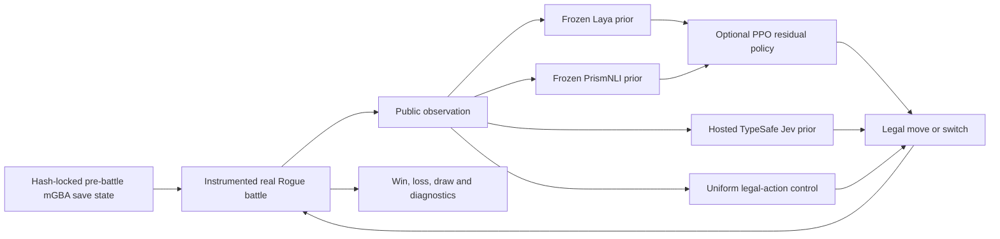

# Frozen decision models + residual RL in Pokémon Emerald Rogue

This is a reproducible experiment for a practical question: **can a frozen decision model play unseen Pokémon Emerald Rogue trainer battles, and can a small learned policy reliably improve it without changing model weights?** It follows the comparison spirit of [Jev vs open decision models](https://github.com/elcronos/jev-vs-open-decision-models), but grounds every decision in a real, visible mGBA battle.

The benchmark compares frozen **Laya**, frozen **PrismNLI-0.4B**, and hosted typed-decision **Jev** on exactly matched held-out battle states. A separate PPO residual can be trained above each frozen action distribution. That is policy learning, **not fine-tuning**: no Laya, PrismNLI, or Jev parameter is updated.

**Current status:** the hash-verified corpus contains 172 states (144 train / 10 validation / 18 test). Laya, PrismNLI, and uniform each won all 18 held-out fixture episodes, so this initial corpus has a win-rate ceiling and cannot rank them. See [the recorded held-out result](docs/results.md); Jev awaits a valid OpenRouter credential.

## Experiment idea

The question is whether a fast frozen model gives reinforcement learning a useful starting point for real Pokémon Emerald Rogue trainer battles. Each method receives the same public battle information and can choose only legal moves or switches. The game supplies the actual outcome; no simulator rewards or fabricated victories are used.



Each model stays frozen. PPO can learn a small correction to its action distribution from training battles, while the uniform control measures the strength of random legal choices under identical conditions. Jev is an independent typed-choice prior, not a PPO policy or a replacement for the local models.

### Hypotheses and success criteria

1. **Zero-shot:** frozen model choice changes held-out battle quality relative to uniform legal action sampling.
2. **Policy steering:** a residual PPO policy improves a frozen prior on held-out battle groups without modifying the prior's weights.

The primary score is scenario-weighted battle win rate. Secondary outcomes are loss/draw/truncation rate, decisions to termination, final player-party HP fraction, action diversity, inference latency, and residual argmax-override rate. Save-state RNG variants are clustered by player-team plus opposing-trainer matchup before statistics, so repeats do not inflate the sample size.

### What the policies see

The observation deliberately contains only information a player can see:

- The active player Pokémon's current exact HP, max HP, level, public types, status, stat stages, and four moves with PP, type, power, category, and accuracy.
- The active enemy's visible species/types, level, status, stat stages, and displayed HP fraction. It never includes hidden enemy moves, held item, ability, exact HP, or unseen bench Pokémon.
- Every player party slot, including current HP and public types, so a policy can select a legal switch.
- Episode-local history: the previous chosen action and the change in player/enemy HP fraction since the previous decision. `FeatureEncoder` derives those fields; mGBA does not leak private memory.

The numerical PPO policy receives these normalized values. Laya and Jev receive a compact text version of the same public information and the descriptions of every legal action. Trainer battles can contain multiple opposing Pokémon: the bridge observes the currently active opponent and the battle continues through each normal send-out until its terminal result.

### Visual examples

The replay below is a real frozen-Laya trajectory. The upper portion is an mGBA capture of the game's own Fight menu, including the original move names and PP/type box; the lower panel retains the selected action and calibrated action probabilities. The capture temporarily opens Fight from the saved decision and restores that exact decision before the policy acts.

These held-out zero-shot replays show mGBA's unmodified Fight menu (real move names, PP, and type box), with the policy distribution in a separate lower panel.


The matched uniform replay uses the same saved battle and seed, making its different action path easy to inspect.

## Setup

Use Apple Silicon, macOS 15+, and Python 3.11–3.13. The supplied environment uses Python 3.12; the machine's default Python 3.14 is outside the upstream CoreML support range.

```sh
uv sync --extra laya --extra prism --extra test
uv run python scripts/setup_laya.py
uv run rogue-rl doctor
uv run pytest -q
```

Alternatively, install `.[laya,test]` in a Python 3.12 virtual environment. `setup_laya.py` downloads about 649 MiB once, pins the upstream artifact revision, verifies its checksum inventory, and writes a receipt. Experiments use local files only. Dependencies are recorded in `uv.lock`.

On this machine mGBA 0.10.5 is installed at `/Applications/mGBA.app`; the model is downloaded under `models/laya-ane96`. Model weights, ROMs, save states, and experiment outputs are ignored by Git.

## Game setup and execution

Follow [the mGBA integration instructions](docs/mgba.md) to reproduce the source build and capture battle states. The ROM and profile are already generated in this workspace. This implementation needs the research build; a normal downloaded Rogue ROM is not interchangeable with it.

1. The locally built research ROM is already at `data/rogue-research.gba` with its generated profile at `data/rogue-profile.json`.
2. Create `data/battles.json` using the schema in `configs/corpus.example.json`. Assign whole team/opponent scenario groups to train, validation, or test before training. Record actual ROM/state SHA256 hashes.
3. Load the ROM in mGBA and load the generated `data/rogue-profile.lua` through **Tools → Scripting**. Keep emulation running. Use fast text and consistent animation settings across states; uncapped speed is allowed.
4. Validate the assets and replay determinism, then run the fixed-budget experiment.

A headless mGBA host is also available. Run `.cache/mgba-runner data/rogue-research.gba data/rogue-profile.lua` instead of step 3. Stop it with Ctrl-C. Reproduce the boot/transport check with `uv run python scripts/smoke_mgba.py`; see the integration guide to rebuild the host.

For a visible live replay, run `scripts/start_live_mgba.sh`, load `data/rogue-profile.lua` through **Tools → Scripting**, and run `rogue-rl visual` from a terminal. The visible game screen continues to animate while the policy controls it.

```sh
uv run rogue-rl validate-corpus
uv run rogue-rl verify-game --steps 500
uv run python scripts/collect_battles.py --count 100 --prefix benchmark
uv run python scripts/split_battles.py --min-train 50
uv run rogue-rl baseline --prior laya --split test --output runs/laya-zero-shot-test
uv run rogue-rl baseline --prior prism --split test --output runs/prism-zero-shot-test
# Jev requires a valid OPENROUTER_API_KEY; it never falls back to another model.
uv run rogue-rl baseline --prior jev --split test --output runs/jev-zero-shot-test
uv run rogue-rl visual --prior laya --split test --output runs/visual-laya

uv run rogue-rl train --mode residual --prior laya  --seed 0 --output runs/laya-residual-0
uv run rogue-rl train --mode residual --prior prism --seed 0 --output runs/prism-residual-0
uv run rogue-rl train --mode residual --prior jev   --seed 0 --output runs/jev-residual-0
```

Repeat all arms for learner seeds **0–4**, sequentially when sharing one emulator. `configs/experiment.json` fixes the budget at 100,000 policy decisions, validation every 5,000 decisions, and at most 500 decisions per battle. First run a separate small engineering pilot; freeze the final configuration before evaluating test data. No CLI command silently substitutes a fake environment or prior.

```sh
uv run rogue-rl summarize runs/frozen-* runs/scratch-* runs/residual-* --output runs/validation-summary.json
uv run rogue-rl evaluate --checkpoint runs/residual-0/checkpoint-000100000.pt
# Evaluate each other final arm/seed checkpoint once, then:
uv run rogue-rl summarize runs/frozen-* runs/scratch-* runs/residual-* --split test --output runs/test-summary.json
```

`evaluate` requires the final budget checkpoint and matching corpus, ROM, profile, and model provenance. It refuses to overwrite test results. Checkpoints are for evaluation; interrupted optimizer-resume is not implemented. Failed runs remain incomplete and are excluded from the final summary.

## What is implemented

- Frozen Laya, matched-capacity scratch PPO, residual PPO, uniform-prior and shuffled-prior controls, and an optional gated-logit residual ablation.
- Ten stable action slots: four moves and six absolute party slots. The game engine supplies legality, including forced switches and Struggle. No bags, fleeing, catching, routes, or team drafting.
- Public-information observations. Hidden opponent moves, ability, item, exact HP, bench, and RNG never reach the policy. The learner's numerical features omit species and move identity; Laya and Jev receive compact semantic text.
- Sparse `+1/-1/0` win/loss/draw reward, PPO clipping, prior KL regularization, and time-limit-correct GAE. Evaluation runs without updates.
- Hashed battle corpus, scenario-group split checks, evaluation traces of prior/final probabilities, learning curves, and paired seed/scenario bootstrap comparisons.
- Loopback mGBA Lua transport with request/decision sequencing, frame and wall-clock limits, explicit game errors, and ROM-specific symbol profiles.

Read [the experiment design](docs/experiment.md), [Laya backend details](docs/laya.md), and [verification evidence and limits](docs/verification.md).
For future systems, follow [the model integration guide](docs/adding-models.md): it preserves the public-information boundary and makes both zero-shot and residual-policy results comparable.

The ANE model has a strict 96-token limit. The default makes **one compact binary-quality query per legal action**, then normalizes those scores. This is an explicitly constructed prior, not Laya's joint categorical output. The optional `joint` strategy with the explicit `general1024` model tests that distinction. Oversized inputs fail before truncation. Benchmark the actual full decision with `uv run python scripts/benchmark_laya.py`; upstream's ~5 ms single-query result is not a full battle-turn timing.
