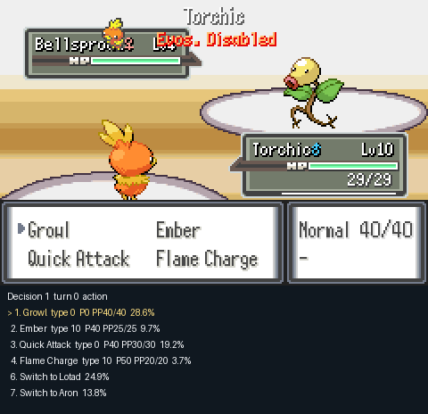
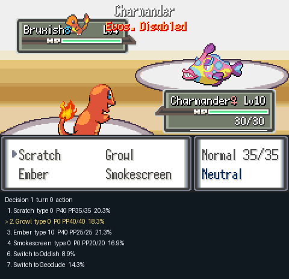
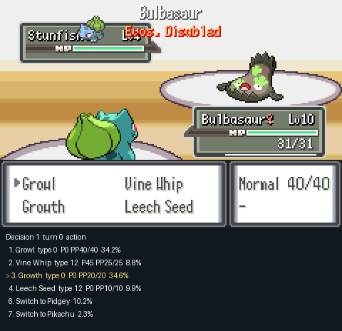
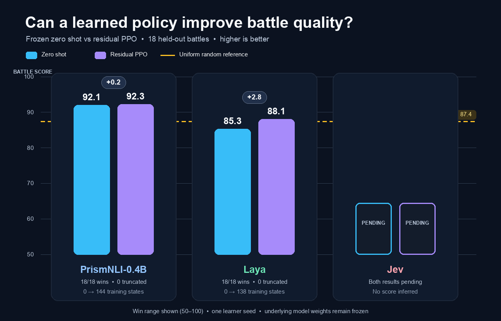
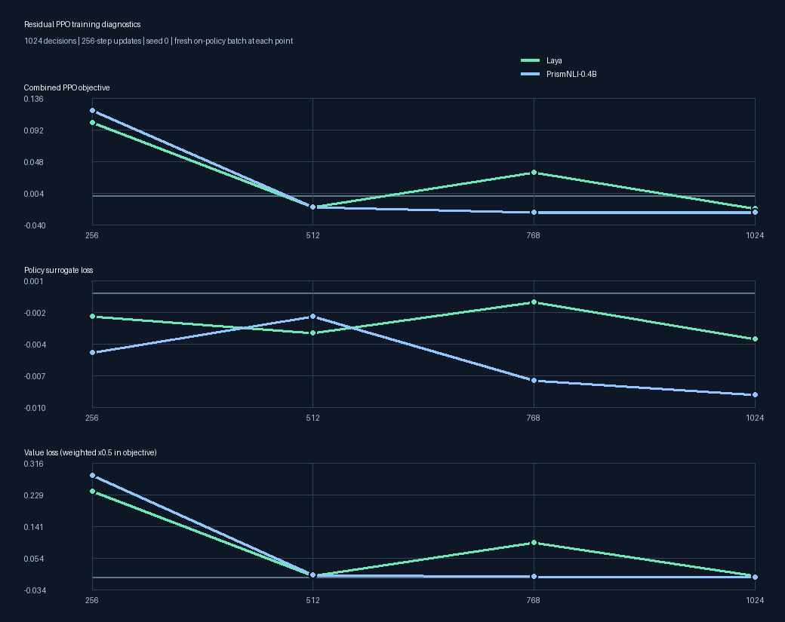
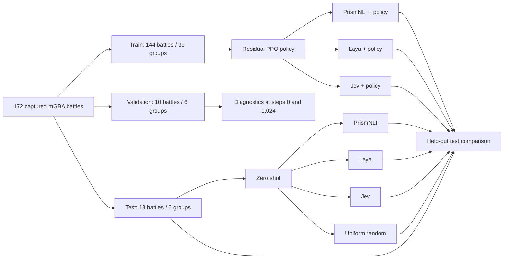

# Decision models learn to battle in Pokémon Emerald Rogue

This repository asks two questions using real trainer battles running in mGBA:

1. How well do **PrismNLI-0.4B, Laya, Jev, and uniform random legal actions** play unseen battles with no game-specific training?
2. Can a small learned policy improve PrismNLI, Laya, or Jev on the same held-out battles while the underlying model stays frozen?

The model is never fine-tuned. Training updates only a small residual PPO policy that steers the model's action probabilities. Uniform random is a zero-shot control and is not trained.

## Watch the models battle

These are real mGBA pixels and real policy samples. The game menu shows the
available moves; the panel below it shows every legal action probability and
highlights the sampled action. These first two replays deliberately use
different held-out battles to show that the benchmark contains different
Pokémon, moves, opponents, and party choices.

<table>
  <tr>
    <th>Laya: Torchic vs Bellsprout</th>
    <th>PrismNLI: Charmander vs Bruxish</th>
  </tr>
  <tr>
    <td></td>
    <td></td>
  </tr>
  <tr>
    <td>Laya samples Growl, then Ember, and wins in 2 decisions.</td>
    <td>PrismNLI opens with Growl and Smokescreen, then attacks, winning in 5 decisions.</td>
  </tr>
</table>

### Same battle, different decisions

For a fair behavioral comparison, each model below starts from the exact same
held-out save state, with the same Bulbasaur–Pidgey–Pikachu party facing
Stunfisk and the same action-sampling seed. Both frozen models win, but they
take visibly different paths.

<table>
  <tr>
    <th>Laya</th>
    <th>PrismNLI-0.4B</th>
    <th>Jev</th>
  </tr>
  <tr>
    <td></td>
    <td></td>
    <td><strong>Real replay pending</strong><br><br>Jev requires a valid OpenRouter credential. This cell remains explicit rather than substituting another model or fabricating its choices.</td>
  </tr>
  <tr>
    <td><strong>10 decisions:</strong> opens with Growth, Leech Seed, Growth; later switches to Pidgey and back.</td>
    <td><strong>17 decisions:</strong> opens with Leech Seed, switches to Pidgey, then cycles through Pidgey, Pikachu, and Bulbasaur.</td>
    <td>The same save state and seed will be used when the provider run is available.</td>
  </tr>
</table>

The comparison reports sampled behavior, not only each model's highest-probability
action. Raw probabilities and selected actions are retained in each replay's
`decisions.jsonl` output.

## Current results

The reproducible pilot corpus contains **172 saved Rogue battles**:

| Split | Battles | Scenario groups | Used for |
| --- | ---: | ---: | --- |
| Train | 144 | 39 | Residual PPO updates |
| Validation | 10 | 6 | Diagnostics at policy steps 0 and 1,024 |
| Test | 18 | 6 | Final zero-shot and trained-policy comparison |

The zero-shot and 1,024-step residual-policy tests are complete for PrismNLI
and Laya. The full local training, validation, and held-out evaluation took
**13 minutes 17 seconds** on a 10-core M1 Max with 64 GB RAM. Jev still needs a
valid OpenRouter credential, so its rows remain explicit rather than inferred.

| Model / policy | Training battles | Validation battles | Test battles | Wins | Truncations | Mean turns | Final party HP | Battle score |
| --- | ---: | ---: | ---: | ---: | ---: | ---: | ---: | ---: |
| PrismNLI-0.4B zero shot | 0 | 0 | 18 | 18/18 | 0/18 | 2.61 | 92.4% | 92.1 / 100 |
| Laya zero shot | 0 | 0 | 18 | 18/18 | 0/18 | 6.17 | 83.5% | 85.3 / 100 |
| Uniform random zero shot | 0 | 0 | 18 | 18/18 | 0/18 | 4.17 | 84.5% | 87.4 / 100 |
| Jev zero shot | 0 | 0 | 18 | — | — | — | — | Not run |
| PrismNLI + residual PPO | 144 | 10 | 18 | 18/18 | 0/18 | 2.72 | 91.6% | 92.3 / 100 |
| Laya + residual PPO | 138 | 10 | 18 | 18/18 | 0/18 | 5.39 | 86.3% | 88.1 / 100 |
| Jev + residual PPO | — | — | — | — | — | — | — | Not run |

“Training battles” is the number of distinct save states actually sampled.
With the same 1,024-decision budget, Laya visited 138 and PrismNLI visited all
144 because their sampled battles had different lengths.





Each point is the mean over the PPO epochs and minibatches for one fresh
256-decision rollout. The combined objective is:

```text
loss = policy_loss + 0.5 × value_loss - 0.01 × entropy + 0.05 × KL(policy || frozen_prior)
```

This is an on-policy diagnostic rather than a supervised loss curve: every
point uses a different rollout, advantage estimate, and value target, so the
total need not decrease monotonically and negative values are valid. The chart
therefore also shows policy and value loss separately. Exact entropy, KL,
gradient norm, and clipping measurements are retained in
[`docs/results.json`](docs/results.json), together with the SHA-256 of each raw
`updates.jsonl` log.

All completed arms won every test battle, so win rate alone cannot separate
them. Laya's learned policy improved its mean score from 85.3 to 88.1, reduced
turns from 6.17 to 5.39, and retained more party HP. PrismNLI was essentially
flat: its score moved from 92.1 to 92.3 while turns and HP became slightly
worse. Its score is the mean of per-battle nonlinear values: the residual had
more zero- and one-turn wins, but also a few long outliers that made arithmetic
mean turns worse. Its mean exponential speed component rose enough to offset
the lower HP component by 0.19 score points. This is a scoring-shape effect,
not evidence of a meaningful improvement. These are single-seed descriptive
results, not evidence of a robust effect or general Pokémon mastery.

## Experiment



Every arm sees the same public battle observation and engine-supplied legal action mask. Actions are four move slots plus six absolute party-switch slots. The experiment never reveals the opponent's hidden moves, held item, ability, exact HP, bench, or RNG state.

| Model | Frozen primitive used as the action prior |
| --- | --- |
| PrismNLI-0.4B | Entailment score for “this is a good action to win” |
| Laya | One binary Noul quality score per legal action |
| Jev | Typed Choice probabilities from the hosted Decisions API |
| Uniform random | Equal probability over legal actions; control only |

For the trained arms, PPO learns residual logits on top of the fixed prior:

```text
final_policy = softmax(log(frozen_prior) + residual_policy(observation))
```

PrismNLI, Laya, and Jev weights never enter the optimizer.

## How battle quality is measured

The game outcome remains the primary result. Within the same outcome, a battle is better when it finishes quickly and preserves the team. For a win with final party HP fraction `H` and game-reported turns `T`:

```text
win_quality = 100 × (0.65 × H + 0.35 × exp(-T / 6))
battle_score = 50 + 0.5 × win_quality
```

This makes a two-turn full-health win score much better than a ten-turn win at half health, while every win still scores above a loss or incomplete run.

| Outcome | Battle score |
| --- | --- |
| Win | 50–100, based on party HP and turns |
| Loss | 0–20, based on remaining party HP |
| Incomplete (truncated) | 0 |

Emerald has an internal `B_OUTCOME_DREW` value for both sides running out of
Pokémon together, but its single-player code treats that as player defeat. The
bridge therefore records it as a loss. A truncation is not a game result: it
means the evaluator stopped an unfinished battle at the fixed 500-decision cap.
Final test tables report the truncation rate separately; it was 0/18 for every
completed arm.

The final table always reports raw wins, turns, party HP, and battle score so the scalar can be audited. Latency, action diversity, switch rate, residual KL, and argmax override rate are additional diagnostics.

The talk-sized protocol fixes the policy configuration before training and uses
validation as a diagnostic at steps 0 and 1,024. The test set is used once at
the end. Its single learner seed makes the result descriptive; it does not
support a confidence interval or a claim that small differences are robust.
See [the complete scoring rule](docs/scoring.md).

## Reproduce the environment

Requirements are Apple Silicon, macOS 15+, Python 3.11–3.13, mGBA 0.10.5, `uv`, and a legally obtained Pokémon Emerald ROM used to build Emerald Rogue. ROMs, model weights, save states, credentials, and run outputs are ignored by Git.

```sh
git clone https://github.com/elcronos/RL_zeroshot.git
cd RL_zeroshot
uv sync --extra laya --extra prism --extra test
uv run python scripts/setup_laya.py
uv run pytest -q
```

Follow [the mGBA research-ROM guide](docs/mgba.md) to pin the Rogue source, install the research hooks, build the ROM, generate its symbol profile, and build the headless mGBA host.

### Recreate the 172-battle corpus

Independent capture lanes use disjoint timing offsets. Each state records its ROM hash, state hash, RNG value, opponent trainer, and three-Pokémon player team.

```sh
uv run python scripts/collect_battles.py --count 100 --prefix benchmark \
  --states data/capture-main --manifest data/capture-main.json
uv run python scripts/collect_battles.py --count 24 --prefix benchmark-a \
  --index-offset 200 --states data/capture-a --manifest data/capture-a.json
uv run python scripts/collect_battles.py --count 24 --prefix benchmark-b \
  --index-offset 400 --states data/capture-b --manifest data/capture-b.json
uv run python scripts/collect_battles.py --count 24 --prefix benchmark-d \
  --index-offset 500 --states data/capture-d --manifest data/capture-d.json

uv run python scripts/merge_corpora.py \
  data/capture-main.json data/capture-a.json data/capture-b.json data/capture-d.json \
  --output data/battles.json
uv run python scripts/split_battles.py --manifest data/battles.json --min-train 50
uv run rogue-rl validate-corpus
uv run rogue-rl verify-game --steps 500
```

Splitting happens by complete player-team/opponent-trainer scenario group, so RNG variants of one matchup cannot cross train, validation, and test.

Start the headless host before running experiments:

```sh
.cache/mgba-runner data/rogue-research.gba data/rogue-profile.lua
```

For a visible emulator window, use `scripts/start_live_mgba.sh`, load `data/rogue-profile.lua` through mGBA's **Tools → Scripting**, and run the same commands below.

## Run the zero-shot benchmark

Each command uses all 18 held-out test battles and zero training battles.

```sh
uv run rogue-rl baseline --prior prism --split test --output runs/prism-zero-shot-test
uv run rogue-rl baseline --prior laya --split test --output runs/laya-zero-shot-test
uv run rogue-rl baseline --prior uniform --split test --output runs/uniform-zero-shot-test

export OPENROUTER_API_KEY="your-key"
uv run rogue-rl baseline --prior jev --split test --output runs/jev-zero-shot-test
```

Every run writes `metadata.json`, raw `episodes.jsonl`, a first-battle decision trace, and `summary.json`. Provider failures remain failed runs; no model falls back to uniform or another backend.

## Train the residual policies

The default is deliberately small enough for a live demo: PrismNLI, Laya, and
Jev use the same 144 training battles, 10 validation battles, **1,024 policy
decisions**, and learner seed 0. Uniform stays a zero-shot random control. On
this 10-core M1 Max with 64 GB RAM, the target is under 30 minutes for the two
local arms plus their held-out evaluations. Jev's hosted API latency is measured
and reported separately because it cannot be bounded by the Mac.

```sh
for prior in prism laya jev; do
  uv run rogue-rl train --mode residual --prior "$prior" --seed 0 \
    --output "runs/${prior}-residual-0"
done
```

The study runner manages the headless mGBA process, skips completed runs,
evaluates each final checkpoint once, records total wall time, and reports
progress in `runs/policy-study-status.json`:

```sh
mkdir -p runs
nohup uv run python scripts/run_policy_study.py --priors laya prism \
  > runs/policy-study.log 2>&1 &

cat runs/policy-study-status.json
tail -f runs/laya-residual-0.log

# Stop cleanly; the active partial seed is retained for diagnosis.
kill "$(cat runs/policy-study.pid)"

# Jev is a separate provider-backed run and requires a valid credential.
OPENROUTER_API_KEY="your-key" uv run python scripts/run_policy_study.py --priors jev
```

An interrupted seed keeps its partial directory for diagnosis. Move or remove
that one incomplete directory before restarting; completed seeds are retained
and skipped.

Training evaluates validation before learning and after 1,024 decisions. The
configuration and budget are fixed in advance; the validation result does not
select a more flattering checkpoint. The study runner performs the final test
evaluation automatically. Use this loop only when training was run manually:

```sh
for prior in prism laya jev; do
  uv run rogue-rl evaluate \
    --checkpoint "runs/${prior}-residual-0/checkpoint-000001024.pt"
done
```

Summarize the validation curves and held-out policy results:

```sh
uv run rogue-rl summarize runs/*-residual-* \
  --output runs/validation-summary.json
uv run rogue-rl summarize runs/*-residual-* --split test \
  --output runs/test-summary.json
```

The published test row uses the fixed 1,024-step checkpoint. With one learner
seed, report the observed wins, turns, party HP, battle score, and wall time
without a confidence interval. A longer multi-seed study is useful for a paper,
but is outside this repository's 30-minute default.

Import the raw PPO update logs into the checked-in registry, or add `--check`
to the first command to verify an existing import without changing it. Then
rebuild the evaluation and training-loss publication plots:

```sh
uv run python scripts/import_training_curves.py \
  --curve 'Laya=runs/laya-residual-0/updates.jsonl' \
  --curve 'PrismNLI-0.4B=runs/prism-residual-0/updates.jsonl'
uv run python scripts/plot_results.py \
  --results docs/results.json --output-dir docs/assets
```

The registry marks only the unavailable Jev arms as `not_run`. A missing result is never rendered as a zero score.

## Visual replays

```sh
uv run rogue-rl visual --prior prism --split test --output runs/visual-prism
uv run rogue-rl visual --prior laya --split test --output runs/visual-laya
uv run rogue-rl visual --prior jev --split test --output runs/visual-jev
```

The GIF uses mGBA's real move-selection menu, including move names, PP, and type. The separate panel shows the model's full legal-action distribution. The opening section contains the checked-in examples and the shared-save comparison.

Recreate the controlled three-model comparison with the same held-out state and
sampling seed:

```sh
shared_battle="benchmark-trainer185-rng3279816710-026"
uv run rogue-rl visual --prior laya --split test --battle-id "$shared_battle" \
  --seed 0 --output runs/visual-laya-shared
uv run rogue-rl visual --prior prism --split test --battle-id "$shared_battle" \
  --seed 0 --output runs/visual-prism-shared
OPENROUTER_API_KEY="your-key" uv run rogue-rl visual --prior jev --split test \
  --battle-id "$shared_battle" --seed 0 --output runs/visual-jev-shared
```

## Documentation

- [Experimental protocol](docs/experiment.md)
- [Scoring and statistical decision rules](docs/scoring.md)
- [Connect another model](docs/adding-models.md)
- [mGBA integration and research ROM](docs/mgba.md)
- [Current recorded results](docs/results.md)
- [Verification evidence and limitations](docs/verification.md)
