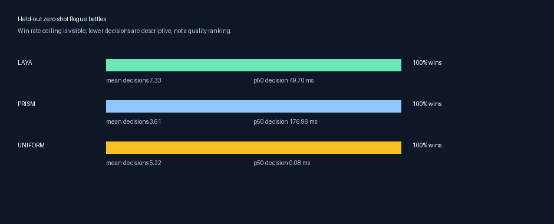

# First held-out baseline

This report was generated from `data/battles.json` with 18 test save states in
six disjoint player-team/opponent-trainer scenario groups. The corpus contains
172 states total: 144 train, 10 validation, and 18 test. The test group has all
six declared player teams.

| Frozen policy | Test wins | Mean decisions | Median decision p50 | Result |
| --- | ---: | ---: | ---: | --- |
| Laya CoreML ANE | 18 / 18 | 7.33 | 49.70 ms | Complete |
| PrismNLI-0.4B | 18 / 18 | 3.61 | 176.96 ms | Complete |
| Uniform legal action | 18 / 18 | 5.22 | 0.08 ms | Complete |
| Jev (OpenRouter) | — | — | — | Not run: valid API credential required |

No policy was trained for this report. Laya and PrismNLI are frozen zero-shot
baselines; uniform is a no-model control. This is deliberately not presented
as evidence that one model plays better: all completed policies reached the
win-rate ceiling, including uniform. The fixture needs harder held-out states
(for example, stronger opposing trainers, unfavorable type matchups, and
resource-constrained party HP) before residual-training test results can
meaningfully test the steering hypothesis.

The exact raw episode records are created under ignored `runs/` directories by
the baseline command. The checked-in GIFs are replays from the same held-out
protocol, and preserve the real in-game move menu.
